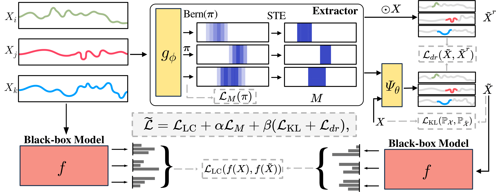

# <p align=center> `TimeX++: Learning Time-Series Explanations with Information Bottleneck`</p>

**Accepted ICML 2024** [[paper]](https://xxxxxx) [[code]](https://github.com/zichuan-liu/TimeXplusplus) 

This repository is the official PyTorch Implementation of TimeX++. Our experiments are based on [TimeX](https://github.com/mims-harvard/TimeX), and thanks to the all original authors! 

Authors: Zichuan Liu, Tianchun Wang, Jimeng Shi, Xu Zheng, Zhuomin Chen, Lei Song, Wenqian Dong, Jayantha Obeysekera, Farhad Shirani, Dongsheng Luo

## Introduction

We posted an introductory presentation on this [[slides]](https://zichuan-liu.github.io/talk/ib_slides.pdf), so you can get a quick overview of our works.

## Citation  
> 🌟 If you find this resource helpful, please consider starting this repository and cite our research:

```bibtex
@inproceedings{liu2024timex,
      title={TimeX++: Learning Time-Series Explanations with Information Bottleneck}, 
      author={Zichuan Liu, Tianchun Wang, Jimeng Shi, Xu Zheng, Zhuomin Chen, Lei Song, Wenqian Dong, Jayantha Obeysekera, Farhad Shirani, Dongsheng Luo},
      year={2024},
      booktitle={Proceedings of the 41st International Conference on Machine Learning}
}
```

## Abstract

Explaining deep learning models operating on time series data is crucial in various applications of interest which require interpretable and transparent insights from time series signals. In this work, we investigate this problem from an information theoretic perspective and show that most existing measures of explainability may suffer from trivial solutions and distributional shift issues. To address these issues, we introduce a simple yet practical objective function for time series explainable learning. The design of the objective function builds upon the principle of information bottleneck (IB), and modifies the IB objective function to avoid trivial solutions and distributional shift issues. We further present TimeX++, a novel explanation framework that leverages a parametric network to produce explanation-embedded instances that are both in-distributed and label-preserving. We evaluate TimeX++ on both synthetic and real-world datasets comparing its performance against leading baselines, and validate its practical efficacy through case studies in a real-world environmental application. Quantitative and qualitative evaluations show that TimeX++ outperforms baselines across all datasets, demonstrating a substantial improvement in explanation quality for time series data.




## Datasets
Our running environment is same as [TimeX](https://github.com/mims-harvard/TimeX), so all datasets can be found on [here](https://doi.org/10.7910/DVN/B0DEQJ).


Requirements are found in `requirements.txt`. Please install the necessary requirements via pip (recommended) or conda.

## How to run

**Example**: Detailed examples of the model are given in the experiment scripts found in `experiments` directory. 
A simple example is given for the freqshape dataset in `experiments/freqshape/bc_model_ptype.py`.

```shell
python bc_model_ptype.py
```

**Reproducibility**: For each dataset script, first modify the `base_path` to correspond to your directory.

1. **Training the black-box model $f$**: Scripts used to train black-box models are included in `experiments/<dataset>/train_transformer.py`. Within these scripts, you can change hyperparameter choices and see usage for setting up the model, training parameters, and more detail please see Table 7 in the papar. 


2. **Training TimeX++ to explain $f$**: Before training, please replace the path to the trained time series predictor that you wish to explain. Then, run:
```shell
python bc_model_ptype.py
```
Parameters can also be modified to train ablation models (please see the paper for more details). For baseline TimeX, you can be reproduced by modifying `is_timex=True` at the beginning of `bc_model_ptype.py`, otherwise, ours is `is_timex=False`. For evaluation and baseline, please refer to this [url](https://github.com/mims-harvard/TimeX/blob/main/reproducibility.md).


**Locations of important implementations**: The TimeX++ can be found in `txai/models/bc_model.py` under the name TimeXModel. 


## Further Reading
Recommend reading the following related works included in the [slides](https://zichuan-liu.github.io/talk/ib_slides.pdf).


1, [**Explaining Time Series via Contrastive and Locally Sparse Perturbations**](https://openreview.net/pdf?id=qDdSRaOiyb), in ICLR 2024.
[\[GitHub Repo\]](https://github.com/zichuan-liu/ContraLSP)

```bibtex
@inproceedings{liu2024explaining,
      title={Explaining Time Series via Contrastive and Locally Sparse Perturbations}, 
      author={Zichuan Liu and Yingying Zhang and Tianchun Wang and Zefan Wang and Dongsheng Luo and Mengnan Du and Min Wu and Yi Wang and Chunlin Chen and Lunting Fan and Qingsong Wen},
      year={2024},
      booktitle={Proceedings of the 12th International Conference on Learning Representations},
      pages={1-21}
}
```


2, [**Protecting Your LLMs with Information Bottleneck**](https://arxiv.org/abs/2404.13968), in Arxiv 2024.
[\[GitHub Repo\]](https://zichuan-liu.github.io/projects/IBProtector/index.html)

```tex
@misc{liu2024protecting,
      title={Protecting Your LLMs with Information Bottleneck}, 
      author={Zichuan Liu and Zefan Wang and Linjie Xu and Jinyu Wang and Lei Song and Tianchun Wang and Chunlin Chen and Wei Cheng and Jiang Bian},
      year={2024},
      eprint={2404.13968},
      archivePrefix={arXiv},
      primaryClass={cs.CL}
}
```

